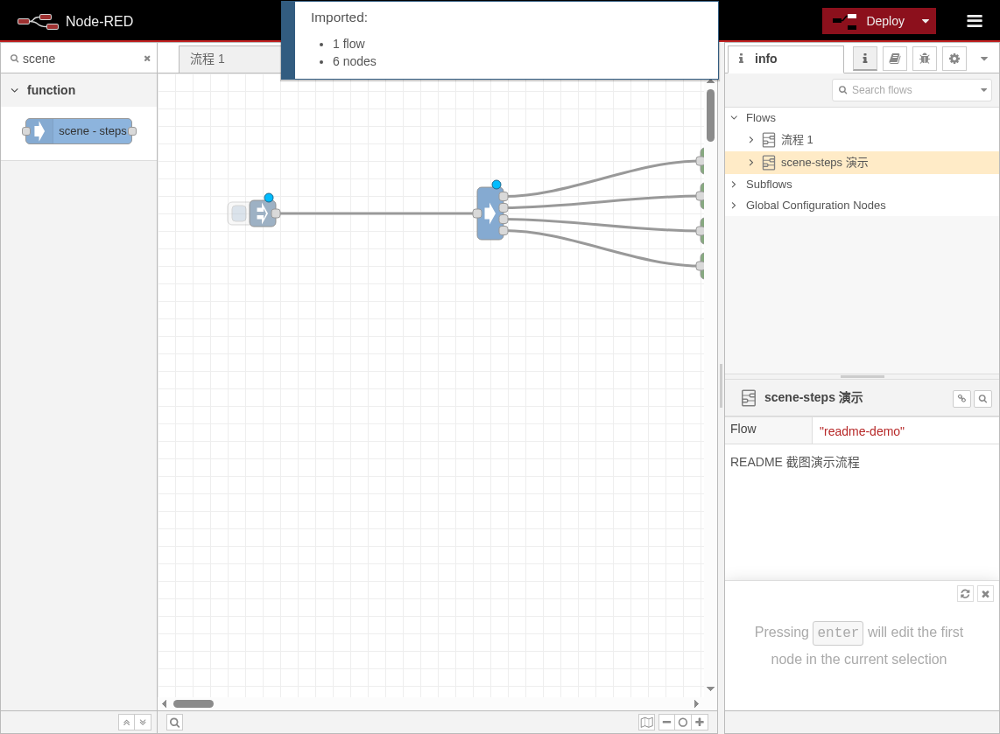
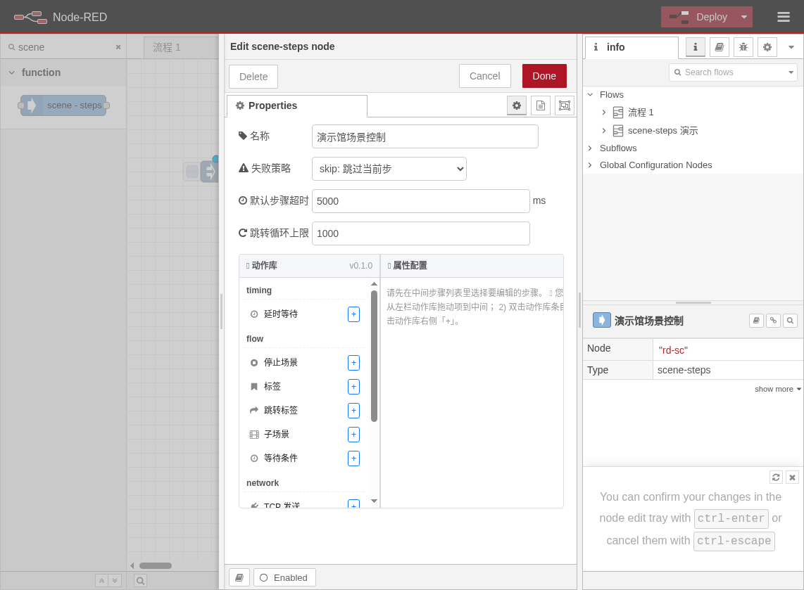
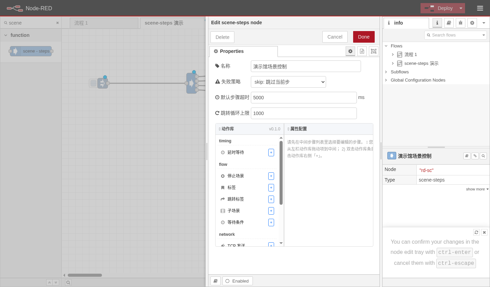
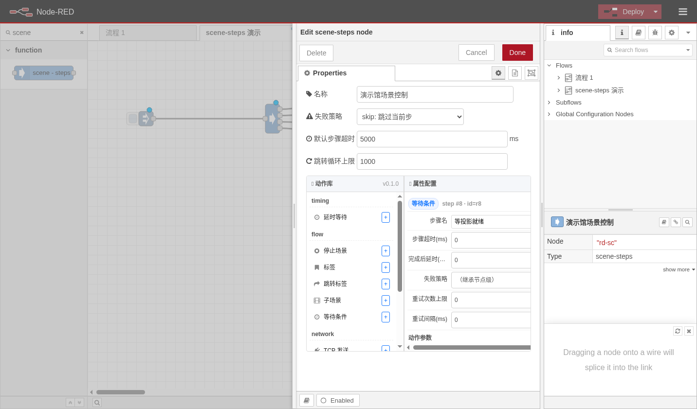

# node-red-contrib-scene-steps

> Node-RED 场景步骤插件 —— 用任务列表替代复杂连线，让中控场景"一键顺序执行"

[](https://nodered.org)
[](LICENSE)
[](package.json)
[](test/)

---

## 是什么？

如果你用 Node-RED 做过中控（智能家居 / 会议室 / 展厅），你一定遇到过这种痛苦：

```
inject → delay → tcp_send → delay → tcp_send → delay → http_request → delay → mqtt_publish → debug
```

**一堆延时节点 + 一堆连线，画布像蜘蛛网，改一个参数要翻半天。**

`scene-steps` 节点把这一切收敛到**一个节点里**——用一个可视化的任务列表管理"先做什么、后做什么、失败怎么办"，就像写脚本一样直观。



> 上图中，一个 `scene-steps` 节点就包含了延时、TCP 发送、HTTP 请求、MQTT 发布等 10 个步骤，外加 4 个 debug 节点接 4 路输出。画布干净清爽。

---

## 核心特性

- **10 个内置动作**：delay / stop / label / jump / call_scene / tcp_send / udp_send / http_request / mqtt_publish / condition_wait
- **Vue3 三栏可视化编辑器**：左栏动作库 → 中栏步骤列表（拖拽排序）→ 右栏配置表单
- **4 路输出**：Step（每步结果）/ Done（完成汇总）/ Error（错误）/ Audit（审计日志）
- **零运行时依赖**：只用 Node.js 原生模块（net / dgram / http / https / vm / timers），装完即用
- **安全沙盒表达式**：模板插值 `{{vars.x}}` + 条件表达式，vm 沙盒隔离，防原型污染
- **TCP 连接池**：自动复用连接，空闲超时释放
- **失败策略**：stop（中止）/ skip（跳过）/ retry:N（重试 N 次），每步可独立覆盖
- **子场景调用**：call_scene 支持内联子步骤 + 递归保护 + 深度限制
- **动态控制**：msg.payload 支持 run / stop / pause / resume / debug / 直接传 steps 数组

---

## 安装

### 方式一：npm 安装（推荐）

```bash
cd ~/.node-red
npm install node-red-contrib-scene-steps
```

### 方式二：从 GitHub 安装

```bash
cd ~/.node-red
npm install czweb/node-red-contrib-scene-steps
```

### 方式三：本地开发

```bash
git clone https://github.com/czweb/node-red-contrib-scene-steps.git
cd node-red-contrib-scene-steps
npm install          # 安装 devDependencies（mocha）
npm link
cd ~/.node-red
npm link node-red-contrib-scene-steps
```

重启 Node-RED 后，调色板中会出现 `scene-steps` 节点（分类：function）。

---

## 快速开始

### 1. 拖入节点

从左侧调色板找到 `scene-steps`，拖到画布上。它的 4 个输出口分别是：

| 输出口 | 含义 | 消息字段 |
|--------|------|----------|
| 1 (step) | 每一步执行完毕的结果 | `payload.stepIndex` / `payload.type` / `payload.ok` / `payload.elapsed` |
| 2 (done) | 全部步骤完成的汇总 | `payload.ok` / `payload.totalSteps` / `payload.okCount` / `payload.elapsed` |
| 3 (error) | 不可恢复错误 | `payload.code` / `payload.message` / `payload.stepIndex` |
| 4 (audit) | 审计事件（启停/暂停/取消） | `payload.event` / `payload.timestamp` |

### 2. 双击打开编辑器



> 三栏布局：左侧动作库（按分类分组），中间步骤列表（拖拽排序），右侧配置表单（JSON Schema 自动生成）。

### 3. 添加步骤

从左栏动作库点击 `+` 或拖拽到中栏步骤列表：



> 10 个动作按 timing / flow / network 三类分组。点击 `+` 直接追加到末尾，或拖拽到指定位置插入。

### 4. 配置步骤参数

点击中栏任意步骤，右栏自动渲染对应的配置表单：



> 每个步骤有：标签（备注名）、配置参数（根据动作类型动态生成）、postDelayMs（步后延时）、timeoutMs（超时）、failBehaviorOverride（独立失败策略）。

### 5. 拖拽排序


> 中栏步骤列表支持 HTML5 原生拖拽排序。每行显示步骤标签、动作类型图标、序号。hover 显示删除按钮。

### 6. 连接输出并 Deploy

把 4 个输出口分别连到 debug 节点，点 Deploy，然后点 inject 触发。

---

## 10 个内置动作

### 流控类

| 动作 | 说明 | 关键参数 |
|------|------|----------|
| `delay` | 固定延时 | `delayMs`（毫秒） |
| `stop` | 停止场景执行 | `emitAsDone`（true 走 Done 口，false 走 Error 口）/ `reason`（原因文本） |
| `label` | 标签标记（jump 跳转目标） | `name`（标签名，A-Za-z_ 开头） |
| `jump` | 跳转到指定 label | `target`（目标标签名）/ `max`（最大跳转次数，默认 10）/ `whenExpr`（条件表达式，空则无条件跳） |
| `call_scene` | 调用子场景 | `mode`（inline_steps / steps_from_var）/ `inline_steps`（内嵌步骤数组）/ `inheritVars`（继承父变量） |

### 网络类

| 动作 | 说明 | 关键参数 |
|------|------|----------|
| `tcp_send` | TCP 发送数据 | `host` / `port` / `payload` / `format`（auto/string/hex/base64）/ `expectResponse` / `keepAlive` / `connectTimeoutMs` |
| `udp_send` | UDP 发送数据 | `host` / `port` / `payload` / `format` / `broadcast` / `bindLocalAddr` / `waitAck` |
| `http_request` | HTTP 请求 | `url` / `method`（GET/POST/PUT/DELETE/PATCH/HEAD/OPTIONS）/ `headers` / `body` / `bodyJson` / `timeoutMs` / `responseParse` |
| `mqtt_publish` | MQTT 发布消息 | `host` / `port` / `clientId` / `username` / `password` / `topic` / `payload` / `format` |

### 条件类

| 动作 | 说明 | 关键参数 |
|------|------|----------|
| `condition_wait` | 等待条件满足 | `expression`（表达式，如 `outputs[-1].status == 200`）/ `intervalMs`（轮询间隔）/ `maxMs`（最长等待） |

---

## 模板插值

所有 `string` 类型的参数都支持模板插值：

```
{{vars.roomId}}          → 引用步骤变量
{{input.payload}}         → 引用输入消息
{{outputs[-1].status}}   → 引用上一步的输出
{{env.HOME}}              → 引用环境变量
```

表达式支持三元运算、比较、数学运算：

```
{{vars.count > 10 ? "full" : "partial"}}
{{outputs[-1].temperature * 9 / 5 + 32}}
```

安全限制（vm 沙盒）：
- 禁止 `eval` / `Function` / `process` / `require` / `globalThis` / `constructor`
- Proxy 阻止 `__proto__` / `prototype` 访问，防原型污染

---

## 动态控制

通过 `msg.payload` 发送指令控制场景执行：

| payload | 效果 |
|---------|------|
| `"run"` 或省略 | 执行节点上配置的 steps |
| `"stop"` | 取消当前运行中的场景 |
| `"pause"` | 暂停执行 |
| `"resume"` | 恢复执行 |
| `"debug"` | Step 口推送当前 steps 配置 + 运行状态 |
| `Array` | 直接作为动态 steps 运行（覆盖节点配置） |

---

## 失败策略

节点级和步骤级两层控制：

| 策略 | 行为 |
|------|------|
| `stop` | 立即中止，Error 口输出错误 |
| `skip` | 跳过当前步，继续下一步 |
| `retry` | 重试 1 次 |
| `retry:3` | 重试 3 次 |
| `retry:5` | 重试 5 次 |

每步可通过 `failBehaviorOverride` 独立覆盖节点级策略。

---

## 示例

仓库 `examples/` 目录包含 4 个示例流程：

| 文件 | 说明 |
|------|------|
| `01-sequential-poweron.json` | 顺序上电：幕布→投影→大屏→灯光（TCP + delay） |
| `02-label-jump-condition-poll.json` | 标签跳转 + 条件轮询（投影机开机重试） |
| `03-dynamic-run-stop-pause.json` | 动态控制（run/stop/pause/resume 按钮组） |
| `04-subscene-reuse-meeting.json` | 子场景复用（会议模式一键切换） |

导入方式：Node-RED 菜单 → Import → 选择 JSON 文件。

---

## 单元测试

```bash
git clone https://github.com/czweb/node-red-contrib-scene-steps.git
cd node-red-contrib-scene-steps
npm install
npm test
```

```
  Task 3 - Flow control actions (label/jump/call_scene)
    ✔ TR-3.1 A->B->A recursion => NESTED_RECURSION
    ✔ TR-3.2 inline subscene + inherit varsMerge writes back okCount
    ✔ TR-3.3 jump whenExpr false does not jump
    ✔ TR-3.4 depth > maxDepth(10) => NEST_TOO_DEEP

  Task 2 - Executor + Template + Cancel
    ✔ TR-2.1: 5 linear steps ok
    ✔ TR-2.2: label + jump max=3 detection LOOP_LIMIT
    ✔ TR-2.3: failBehavior stop/skip/retry:3
    ✔ TR-2.4: cancel during delay < 300ms
    ✔ TR-2.5: template interpolations + proto pollution + unsafe keywords

  Task 1 MVP
    ✔ TR-1.1: 0 runtime dependencies
    ✔ TR-1.2: registry lists 10 actions
    ✔ TR-1.3: require("./nodes/scene-steps") succeeds

  13 passing (63ms)
```

---

## 项目结构

```
node-red-contrib-scene-steps/
├── actions/               # 10 个动作实现
│   ├── delay.js
│   ├── stop.js
│   ├── label.js
│   ├── jump.js
│   ├── call_scene.js
│   ├── tcp_send.js
│   ├── udp_send.js
│   ├── http_request.js
│   ├── mqtt_publish.js
│   ├── condition_wait.js
│   └── index.js            # 动作注册聚合
├── nodes/
│   ├── scene-steps.js      # 节点运行时（注册 + 输入处理 + 输出映射）
│   ├── scene-steps.html    # 节点编辑器（Vue3 三栏 + Schema 表单）
│   └── lib/
│       ├── executor.js     # 执行引擎（循环/跳转/重试/递归保护）
│       ├── template.js     # 模板插值（vm 沙盒 + 原型污染防护）
│       ├── registry.js     # 动作注册表（验证 + 枚举）
│       ├── cancel.js       # 取消信号（AbortController 风格）
│       ├── tcp_pool.js     # TCP 连接池（复用 + 空闲释放）
│       └── errors.js       # 错误码枚举
├── examples/               # 4 个示例流程
├── test/unit/              # 单元测试（13 条）
├── icons/                  # 节点图标
├── package.json            # 0 运行时依赖
└── .gitignore
```

---

## 技术规格

| 项目 | 规格 |
|------|------|
| Node-RED 版本 | 4.0+ |
| Node.js 版本 | 18+ |
| 运行时依赖 | 0（纯 Node.js 原生模块） |
| 编辑器前端 | Vue 3.4（CDN 加载，离线自动降级） |
| 安全沙盒 | vm.createContext + Proxy 原型保护 |
| TCP 连接池 | Map<key, Socket[]>，空闲超时 60s |
| 测试覆盖率 | 13 条单元测试，覆盖执行引擎/模板/取消/流控/递归 |

---

## 常见问题

**Q: 编辑器打不开 / 白屏？**

A: Vue3 通过 CDN 加载，需要网络。离线环境会自动降级为 JSON 文本编辑器。如需离线使用 Vue3，把 `vue.global.prod.js` 放到 `nodes/` 目录并修改 `scene-steps.html` 中的 CDN 路径。

**Q: TCP 发送后收不到响应？**

A: 检查 `expectResponse` 是否设为 `true`，以及 `readDelimiter` 或 `readLen` 是否正确配置。TCP 响应读取支持：按分隔符、按长度、按超时三种模式。

**Q: jump 会不会死循环？**

A: 不会。每个 jump 都有 `max` 参数（默认 10），超过次数会抛 `LOOP_LIMIT` 错误到 Error 口。节点级还有 `maxLoopLimit`（默认 1000）兜底。

**Q: call_scene 递归怎么办？**

A: 执行引擎维护祖先链，检测到递归（A→B→A）会立即抛 `NESTED_RECURSION`。嵌套深度超过 10 层会抛 `NEST_TOO_DEEP`。

**Q: 如何在步骤间传递变量？**

A: 步骤的 `output` 对象会自动追加到 `outputs` 数组，后续步骤可通过 `{{outputs[-1].xxx}}` 引用上一步输出。`call_scene` 配合 `inheritVars: true` 可让子场景继承父级变量。

**Q: 支持 MQTT QoS 1/2 吗？**

A: 当前 MVP 仅支持 QoS 0（fire and forget）。QoS 1/2 需要额外依赖 MQTT broker 库，与"零运行时依赖"原则冲突，计划后续作为可选插件提供。

---

## License

MIT
